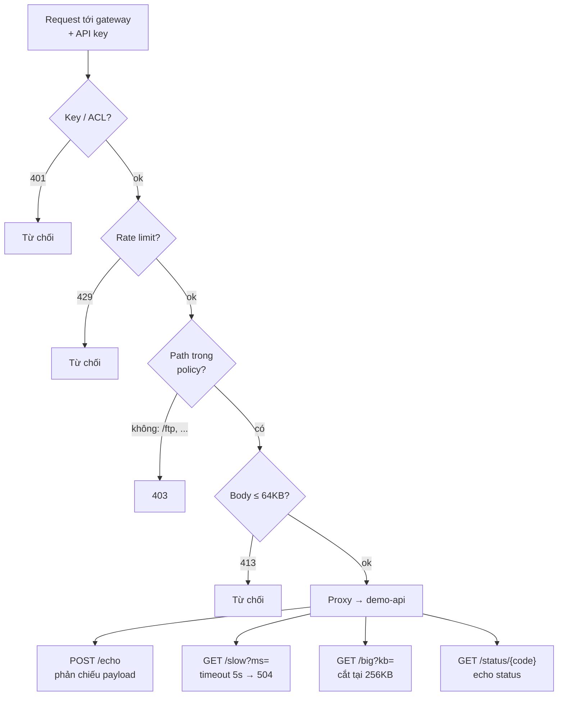

# Kịch bản báo cáo Tuần 4 (cho mentor)

Mục tiêu: ~3–5 phút. Đọc theo mạch, chạy demo ở mục 3.

---

## 1. Tóm tắt 30 giây

> "Tuần 4 em xây một **API Gateway** đặt trước ứng dụng thử nghiệm, và một **công
> cụ Python** chỉ biết đúng một địa chỉ là gateway. Công cụ đề xuất và gửi request
> kiểm thử với payload an toàn, còn **gateway là thứ duy nhất quyết định request
> nào được đi tiếp**. Điểm chính: guardrail nằm **ngoài** tiến trình bị kiểm thử,
> nên kể cả công cụ bị lỗi/chiếm quyền cũng không vượt được rào."

## 2. Vấn đề → Giải pháp (1 phút)

- **Vấn đề (Tuần 3):** allowlist nằm chung tiến trình với agent đọc dữ liệu target
  → một agent bị prompt injection có thể tự bỏ qua allowlist của chính nó.
- **Giải pháp (Tuần 4):** tách guardrail ra **tiến trình riêng** (gateway) + thu
  hẹp đầu ra của bộ đề xuất (planner chỉ chọn `route_id`/`payload_id` có sẵn).
- Bằng chứng "mọi request qua gateway" là **topology**: target nằm trên mạng
  `internal: true`, **không publish port**.

## 3. Demo trực tiếp (2 phút)

Chỉ cần **hai lệnh** — script demo tự nạp API key nên không lo lỗi 401:

```bash
bash scripts/up.sh                 # dựng gateway + demo-api, sinh API key (1 lần)
bash scripts/demo.sh               # chạy tuần tự 5 bước bên dưới
# (tuỳ chọn) bash scripts/demo.sh --with-smoke   # kèm chứng minh 7 mã lỗi
```

`scripts/demo.sh` in ra từng bước; khi mỗi bước chạy, **nói**:

| Bước script in ra | Nói gì |
|---|---|
| 1) `routes` | "Công cụ **không hard-code** allowlist — nó hỏi gateway route nào được phép." |
| 2) `get /api/items` → 200 | "Request hợp lệ đi qua gateway tới target, trả 200." |
| 3) `get /ftp` → 403 | "Endpoint ngoài allowlist bị chặn **403**, không hề tới target." |
| 4) `post /echo` → phản chiếu | "Payload an toàn (sai kiểu) được target phản chiếu — không đổi dữ liệu thật." |
| 5) `plan --goal ...` | "Demo **Agent đề xuất** loạt request an toàn và **công cụ thực hiện** — planner chỉ chọn trong thực đơn gateway công bố." |

Chốt demo: `docker compose ps` → "target trống cột PORTS; thử `curl localhost:8000`
→ `000`, không có đường vào ngoài gateway."

> Nếu muốn chạy tay từng lệnh (không dùng script): **phải nạp key trước**, nếu
> không gateway trả 401.
> ```bash
> set -a; . ./.env; set +a
> PYTHONPATH=src python3 -m safe_probe.cli routes
> PYTHONPATH=src python3 -m safe_probe.cli get /api/items
> PYTHONPATH=src python3 -m safe_probe.cli get /ftp
> PYTHONPATH=src python3 -m safe_probe.cli post /echo --payload wrong-type-int
> PYTHONPATH=src python3 -m safe_probe.cli plan --goal "input validation"
> ```

## 4. Kết quả — tiêu chí hoàn thành (1 phút)

| Tiêu chí | Đạt | Bằng chứng |
|---|---|---|
| Endpoint bị cấm không gọi được | ✅ | `get /ftp` → 403 |
| Mọi request đi qua gateway | ✅ | topology `internal: true`, không port |
| Xử lý lỗi timeout & kết nối | ✅ | `Result.error` phân biệt `timeout` vs `connection error` |
| Có nhật ký request/response | ✅ | `data/gateway-audit.jsonl` (server, bắt mọi request) + `data/tool-audit.jsonl` (client) — xem mục 6 |
| Nhật ký không lưu API key | ✅ | grep key trên **cả hai** log = **0**, redaction tại sink |

Tất cả tái sinh được bằng `scripts/evidence.sh` → lưu ở `reports/evidence/`.
Kiểm thử: `ruff` sạch + **27 test** pass.

## 5. Luồng kiểm thử bằng curl — chứng minh từng nhánh if-else

Pipeline của gateway là một chuỗi cổng: request phải **qua hết** mới tới target.
Mỗi khối quyết định dưới đây có **một curl** chứng minh nhánh "từ chối" và nhánh "ok".



**Chuẩn bị** (nạp API key vào shell, đặt biến `KEY` cho gọn):

```bash
set -a; . ./.env; set +a
KEY="$GATEWAY_API_KEY"        # cùng giá trị SAFE_PROBE_API_KEY dùng cho tool
BASE="http://localhost:8080"
```

### Khối 1 — AUTH `{Key / ACL?}`

Không có (hoặc sai) API key → **401**, request dừng ngay, không tới target.

```bash
# NHÁNH 401: thiếu header X-API-Key
curl -s -o /dev/null -w "%{http_code}\n" "$BASE/api/items"
# → 401

# NHÁNH ok: có key hợp lệ
curl -s -o /dev/null -w "%{http_code}\n" -H "X-API-Key: $KEY" "$BASE/api/items"
# → 200
```

### Khối 2 — RATE `{Rate limit?}`

Vượt `rate_per_minute: 30` (token bucket theo key) → **429**. Bắn 40 request:

```bash
# NHÁNH 429: 30 request đầu 200, phần dư 429
for i in $(seq 1 40); do
  curl -s -o /dev/null -w "%{http_code}\n" -H "X-API-Key: $KEY" "$BASE/health"
done | sort | uniq -c
# →   30 200
# →   10 429
```

> Lệnh này làm cạn bucket. Chờ ~60s trước khi chạy các khối sau, nếu không sẽ dính 429 nhầm.

### Khối 3 — ROUTE `{Path trong policy?}`

Path không nằm trong allowlist → **403**, không hề chạm target.

```bash
# NHÁNH 403: /ftp không có trong policy.yml
curl -s -o /dev/null -w "%{http_code}\n" -H "X-API-Key: $KEY" "$BASE/ftp"
# → 403

# NHÁNH có (trong policy): /api/items
curl -s -o /dev/null -w "%{http_code}\n" -H "X-API-Key: $KEY" "$BASE/api/items"
# → 200
```

### Khối 4 — SIZE `{Body ≤ 64KB?}`

Body vượt `max_request_bytes: 65536` (64KB) → **413**, gateway chặn trước khi proxy.

```bash
# NHÁNH 413: body ~70KB > 64KB
curl -s -o /dev/null -w "%{http_code}\n" -X POST \
  -H "X-API-Key: $KEY" -H "Content-Type: application/json" \
  --data "$(python3 -c 'print("A"*70000)')" "$BASE/echo"
# → 413

# NHÁNH ok: body nhỏ
curl -s -o /dev/null -w "%{http_code}\n" -X POST \
  -H "X-API-Key: $KEY" -H "Content-Type: application/json" \
  -d '{"msg":"hi"}' "$BASE/echo"
# → 200
```

### Khối 5 — PROXY → demo-api (4 endpoint mẫu)

Qua hết 4 cổng, request tới target. Bốn kiểu phản hồi để soi từng hành vi:

```bash
# ECHO: phản chiếu payload an toàn (không đổi dữ liệu thật)
curl -s -X POST -H "X-API-Key: $KEY" -H "Content-Type: application/json" \
  -d '{"msg":"hello","n":42}' "$BASE/echo"
# → {"received":{"msg":"hello","n":42}}

# SLOW: target ngủ 6000ms > timeout 5s → gateway trả 504
curl -s -o /dev/null -w "%{http_code}\n" -H "X-API-Key: $KEY" "$BASE/slow?ms=6000"
# → 504

# BIG: target trả 300KB, gateway cắt tại 256KB (max_response_bytes) và gắn X-Truncated
curl -s -D - -o /dev/null -H "X-API-Key: $KEY" "$BASE/big?kb=300" \
  | grep -iE "^(HTTP|content-length|x-truncated|x-gateway-route)"
# → HTTP/1.1 200 OK
# → x-gateway-route: big
# → x-truncated: true
# → content-length: 262144        (= 256KB)

# STATUS: gateway truyền nguyên status của upstream
curl -s -o /dev/null -w "%{http_code}\n" -H "X-API-Key: $KEY" "$BASE/status/418"
# → 418
```

> Toàn bộ curl trên đã được chạy thật; con số ở comment là output quan sát được.
> Kết quả này cũng tái sinh tự động qua `scripts/smoke.sh` (7 mã lỗi) và
> `scripts/evidence.sh` (lưu vào `reports/evidence/`).

## 6. Nhật ký request/response — deliverable #4

Có **hai** file log, hai góc nhìn khác nhau, cả hai đều nằm trong `data/` và
**không bao giờ chứa API key**:

| File | Ai ghi | Ghi khi nào | Trả lời câu hỏi |
|---|---|---|---|
| `data/gateway-audit.jsonl` | **gateway** (server) | **mọi** request tới gateway, kể cả `curl` | request đi qua đâu, tới upstream nào, lúc nào, method gì, header gì, quyết định gì |
| `data/tool-audit.jsonl` | **tool** (client) | chỉ khi dùng `safe_probe` | tool đã gửi gì, nhận status/route/error nào |

> **Vì sao chạy `curl` mà `data/tool-audit.jsonl` không có gì?** Vì file đó là log
> **của tool** — `curl` không phải tool nên đương nhiên không ghi vào đó. Log bắt
> **mọi** traffic (kể cả `curl`) là `data/gateway-audit.jsonl` — ghi bởi chính
> gateway, đúng tinh thần "guardrail ngoài tiến trình".

**Một dòng log gateway trả lời trọn vẹn các câu hỏi của mentor:**

```json
{
  "ts": "2026-08-17T03:13:00.076981+00:00",   // bắn vào thời gian nào
  "client_ip": "172.29.0.1",                  // từ client nào (IP nguồn)
  "caller": "key-eefe386a",                   // danh tính caller = hash(key), KHÔNG phải key
  "method": "POST",                           // qua method nào
  "path": "/echo",
  "query": null,
  "route": "echo",                            // khớp route nào trong allowlist
  "upstream": "http://demo-api:8000/echo",    // request đi tới đâu (upstream/target)
  "decision": "proxied",                      // gateway quyết định gì
  "status": 200,                              // response trả về
  "req_bytes": 12, "resp_bytes": 25, "truncated": false,
  "duration_ms": 30.5,
  "headers": {                                // có trường header nào
    "host": "localhost:8080",
    "user-agent": "curl/8.5.0",
    "accept": "*/*",
    "x-api-key": "***REDACTED***"             // KEY BỊ CHE ngay tại nơi ghi (sink)
  }
}
```

`decision` phản chiếu đúng pipeline ở mục 5: `unauthorized` (401), `rate_limited`
(429), `forbidden` (403), `method_not_allowed` (405), `payload_too_large` (413),
`upstream_timeout` (504), `upstream_unavailable` (502), `proxied` (2xx/4xx của target).

**Xem log sau khi demo bằng curl:**

```bash
# Toàn bộ request curl vừa gửi đều nằm ở đây, mỗi dòng 1 request:
tail -n 20 data/gateway-audit.jsonl | python3 -m json.tool 2>/dev/null || tail -n 20 data/gateway-audit.jsonl

# Chứng minh KHÔNG lộ key: tìm key thô -> không có; đếm số dòng đã che -> có
set -a; . ./.env; set +a
grep -c "$GATEWAY_API_KEY" data/gateway-audit.jsonl   # → 0 (không có key thô)
grep -c '\*\*\*REDACTED\*\*\*'  data/gateway-audit.jsonl   # → số request có gửi key
```

Redaction đặt tại **sink** (`gateway/audit.py`): mọi bản ghi đều đi qua đó trước
khi chạm đĩa nên không nơi gọi nào "quên" che được. `scripts/verify.sh` grep key
trên **cả hai** file log và phải cho `PASS`.

---

Repo: https://github.com/phoebe497/API-Gateway · Chi tiết: `docs/onboarding.md`,
`reports/2026-08-14_NguyenNhuYenPhuong_Week4.md`.
