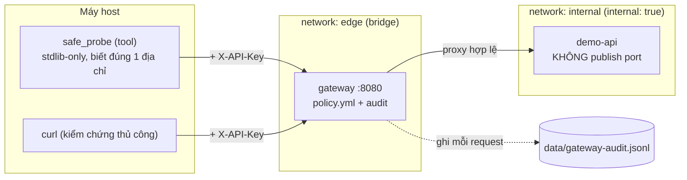
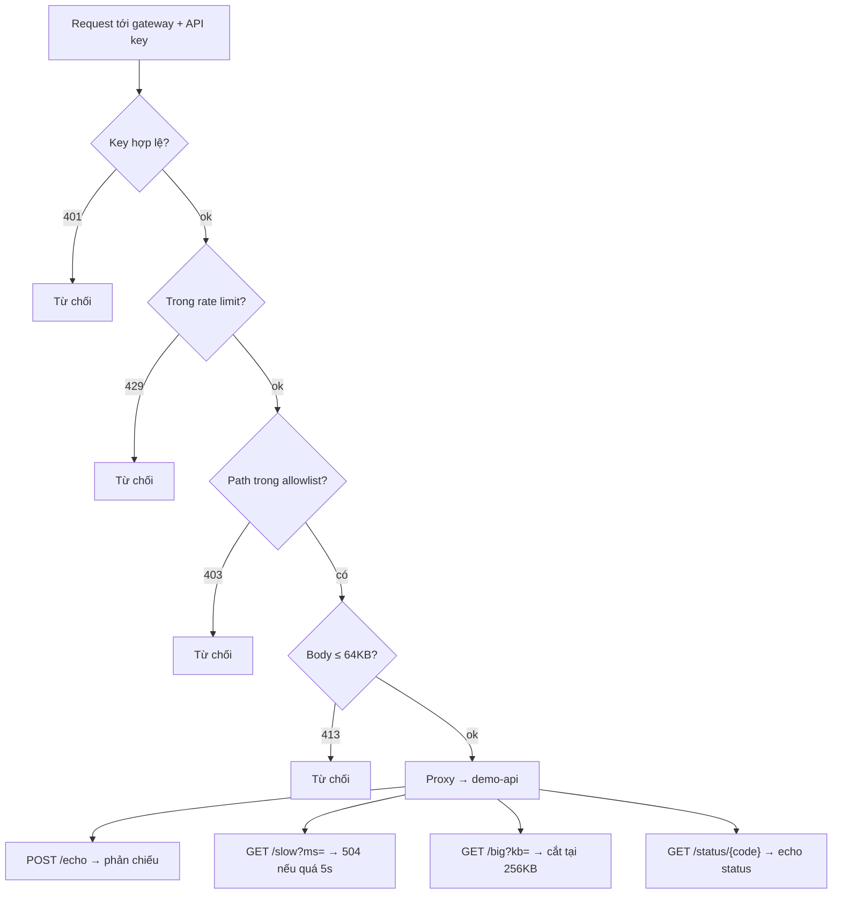

# Tuần 4 — API Gateway và kiểm thử request an toàn

- **Người thực hiện:** Nguyễn Như Yến Phương
- **Ngày:** 2026-08-12
- **Repo:** https://github.com/phoebe497/API-Gateway
- **Mục tiêu:** đặt một API Gateway trước ứng dụng thử nghiệm, viết công cụ Python
  chỉ biết đúng địa chỉ gateway để gửi request kiểm thử với payload an toàn, và
  demo một agent đề xuất request để công cụ thực hiện. Yêu cầu xuyên suốt:
  **gateway là thứ duy nhất quyết định request nào được đi tiếp** — guardrail nằm
  ngoài tiến trình bị kiểm thử.

## 1. Tổng quan những gì đã triển khai

- **API Gateway tự viết** (FastAPI + httpx) đóng vai reverse proxy: xác thực API
  key, giới hạn tần suất, kiểm tra allowlist, giới hạn kích thước body/response,
  chuyển tiếp lên upstream và ghi nhật ký. Mọi ngưỡng/quy tắc đọc từ
  `gateway/policy.yml`, code không hard-code chính sách.
- **Ứng dụng thử nghiệm `demo-api`** — target chỉ-đọc/phản chiếu, đặt trên mạng
  nội bộ **không publish port** nên chỉ tới được qua gateway.
- **Công cụ Python `safe_probe`** (stdlib-only): gửi GET/POST, đặt header, đọc
  status và một phần response; tự áp giới hạn phía client (tần suất, timeout, kích
  thước đọc); ghi audit log; và một planner đề xuất request an toàn.
- **Nhật ký request/response** ở hai phía (gateway và tool), tuyệt đối không lưu
  API key.
- **Bộ script vận hành** (`up/down/smoke/verify/evidence/demo`) và **bằng chứng
  tái sinh được** trong `reports/evidence/`.

## 2. Kiến trúc



- **`gateway/`** — reverse proxy generic. Chuỗi kiểm soát (auth → rate limit →
  allowlist → size → proxy) chạy theo thứ tự cố định; mọi quyết định lấy từ
  `gateway/policy.yml`. Ghi nhật ký mọi request ra `data/gateway-audit.jsonl`
  (`gateway/audit.py`).
- **`targets/demo-api/`** — target an toàn: `/health`, `/api/items`,
  `/api/items/{id}`, `/echo` (phản chiếu), `/slow` (giả lập chậm → test timeout),
  `/big` (trả body lớn → test cắt response), `/status/{code}` (echo status),
  `/login` (luôn từ chối). Không endpoint nào đổi dữ liệu thật.
- **`src/safe_probe/`** — công cụ Python stdlib-only: `client · limits · payloads
  · audit · plan · cli`. Không import `gateway/`, không hard-code allowlist (học
  qua `GET /_gateway/routes`), payload chỉ gồm chuỗi dài/ký tự đặc biệt/rỗng/sai
  kiểu (mẫu phá hoại bị chặn bởi `FORBIDDEN_PATTERNS`).
- **Nguyên tắc cốt lõi:** guardrail đặt **ngoài** tiến trình bị kiểm thử. Kể cả
  công cụ bị lỗi hay chiếm quyền, nó cũng không sửa được policy của một process
  khác. Chi tiết: `docs/adr/0001` (chọn gateway tự viết) và `docs/adr/0002`
  (guardrail hai lớp).

## 3. Pipeline xử lý request + kiểm chứng bằng `curl`

Mỗi request phải **qua hết** các cổng dưới đây mới tới target; mỗi khối quyết định
đều có một lệnh `curl` chứng minh.



Chuẩn bị (nạp API key, đặt biến cho gọn):

```bash
set -a; . ./.env; set +a
KEY="$GATEWAY_API_KEY"; BASE="http://localhost:8080"
```

```bash
# AUTH — thiếu key → 401; có key → 200
curl -s -o /dev/null -w "%{http_code}\n" "$BASE/api/items"                       # 401
curl -s -o /dev/null -w "%{http_code}\n" -H "X-API-Key: $KEY" "$BASE/api/items"  # 200

# RATE — vượt 30 req/phút → 429 (30 request đầu 200, phần dư 429)
for i in $(seq 1 40); do curl -s -o /dev/null -w "%{http_code}\n" \
  -H "X-API-Key: $KEY" "$BASE/health"; done | sort | uniq -c        # 30x200, 10x429

# ROUTE — path ngoài allowlist → 403 (không chạm target)
curl -s -o /dev/null -w "%{http_code}\n" -H "X-API-Key: $KEY" "$BASE/ftp"        # 403

# SIZE — body ~70KB > 64KB → 413
curl -s -o /dev/null -w "%{http_code}\n" -X POST -H "X-API-Key: $KEY" \
  -H "Content-Type: application/json" \
  --data "$(python3 -c 'print("A"*70000)')" "$BASE/echo"                         # 413

# PROXY — bốn hành vi mẫu ở target
curl -s -X POST -H "X-API-Key: $KEY" -H "Content-Type: application/json" \
  -d '{"msg":"hello","n":42}' "$BASE/echo"          # {"received":{"msg":"hello","n":42}}
curl -s -o /dev/null -w "%{http_code}\n" -H "X-API-Key: $KEY" "$BASE/slow?ms=6000"   # 504
curl -s -D - -o /dev/null -H "X-API-Key: $KEY" "$BASE/big?kb=300" \
  | grep -i x-truncated                               # x-truncated: true (cắt tại 256KB)
curl -s -o /dev/null -w "%{http_code}\n" -H "X-API-Key: $KEY" "$BASE/status/418"     # 418
```

Toàn bộ 7 mã từ chối (401/403/404/405/413/429/504) cũng được `scripts/smoke.sh`
kiểm tự động (`evidence/07-smoke.txt`).

## 4. Nhật ký request/response (deliverable #4)

Hai file log bổ trợ nhau, đều nằm trong `data/` và **không** chứa API key:

| File | Ai ghi | Ghi khi nào | Vai trò |
|---|---|---|---|
| `data/gateway-audit.jsonl` | gateway (server) | **mọi** request, kể cả `curl` | nhật ký request/response chính |
| `data/tool-audit.jsonl` | tool (client) | chỉ khi dùng `safe_probe` | công cụ đã gửi/nhận gì |

Mỗi request là một dòng JSON, trả lời trọn vẹn "ai gọi, lúc nào, tới đâu, method
gì, header nào, kết quả gì" (`evidence/08-request-log.txt`):

```json
{
  "ts": "2026-08-17T03:13:00.076981+00:00",   // thời gian
  "client_ip": "172.29.0.1",                  // client nguồn
  "caller": "key-eefe386a",                   // danh tính = hash(key), KHÔNG phải key
  "method": "POST", "path": "/echo",
  "route": "echo", "upstream": "http://demo-api:8000/echo",   // đi qua route nào, tới đâu
  "decision": "proxied", "status": 200,
  "req_bytes": 12, "resp_bytes": 25, "truncated": false, "duration_ms": 30.5,
  "headers": { "user-agent": "curl/8.5.0", "x-api-key": "***REDACTED***" }  // key bị che
}
```

Redaction đặt tại **sink** (mọi bản ghi đi qua đó trước khi chạm đĩa nên không nơi
gọi nào "quên" che): phía tool `audit.py::_clean`, phía gateway `gateway/audit.py`.
`scripts/verify.sh` grep key trên **cả hai** file và cho `PASS`.

## 5. Bằng chứng theo tiêu chí hoàn thành

> Mọi output sinh tự động bởi `scripts/evidence.sh`, lưu thô trong
> `reports/evidence/` (xem `00-INDEX.md`). Xoá thư mục rồi chạy lại sẽ cho kết quả
> tương đương — không chép tay.

| Tiêu chí hoàn thành | Kết quả | Bằng chứng |
|---|---|---|
| Không gọi trực tiếp được endpoint bị cấm | `get /ftp` → **403**, không chạm target | `evidence/07-smoke.txt` |
| Mọi request đều đi qua gateway | topology `internal: true`, target không có port; gọi thẳng `:8000` → `000` | `evidence/01-topology.txt` |
| Công cụ xử lý lỗi timeout & kết nối | phân biệt `error="timeout"` vs `connection error`, có test phủ | `tests/test_client.py` |
| Nhật ký không lưu API key | grep key trên cả hai log = **0**, redaction tại sink | `evidence/05-redaction.txt`, `08-request-log.txt` |
| Đủ mã 401/403/404/405/413/429/504 | 7/7 PASS | `evidence/07-smoke.txt` |
| Allowlist do gateway công bố (tool không hard-code) | `GET /_gateway/routes` | `evidence/02-routes.txt` |

**Demo agent đề xuất — công cụ thực hiện.** `safe_probe plan --goal "input
validation"`: planner chỉ phát ra `route_id + payload_id` từ thực đơn gateway công
bố, công cụ tra ngược ra path và thực hiện. Planner không ghép URL, không đặt
header, không thấy key; `plan.validate()` từ chối mọi id ngoài thực đơn
(`evidence/03-plan.txt`, `tests/test_plan.py`).

## 6. Chất lượng & cách tái lập

- **Chất lượng:** `ruff check` sạch; `pytest` **27/27 pass** (payloads, redaction,
  plan, client, bất biến "tool không import gateway"). Xem `evidence/06-verify.txt`.
- **Tái lập:**

```bash
bash scripts/up.sh                 # sinh key -> .env, dựng gateway + demo-api
set -a; . ./.env; set +a           # nạp key cho công cụ
bash scripts/smoke.sh              # 401/403/404/405/413/429/504
PYTHONPATH=src python3 -m safe_probe.cli plan --goal "input validation"
bash scripts/verify.sh             # ruff + pytest + grep key (cả 2 log)
bash scripts/evidence.sh           # sinh lại toàn bộ bằng chứng -> reports/evidence/
bash scripts/down.sh
```

> `smoke.sh` làm cạn rate bucket ở bước cuối; chờ ~70s trước khi chạy lại `suite`.

## 7. Hạn chế và hướng phát triển

- Planner hiện là rule-based (chủ ý — an toàn đến từ thu hẹp đầu ra). Có thể cắm
  LLM thật vào `plan.propose` mà không đổi bất biến, miễn đầu ra vẫn qua
  `plan.validate`.
- Rate bucket là in-memory theo tiến trình gateway; chạy nhiều replica cần store
  dùng chung.
- `ggshield` chưa cài trong môi trường nên `verify.sh` báo SKIP thay vì fail.
